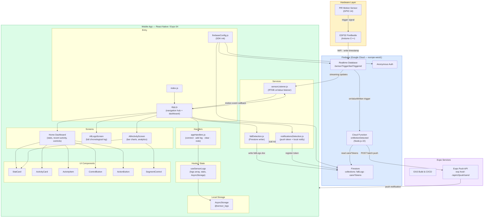
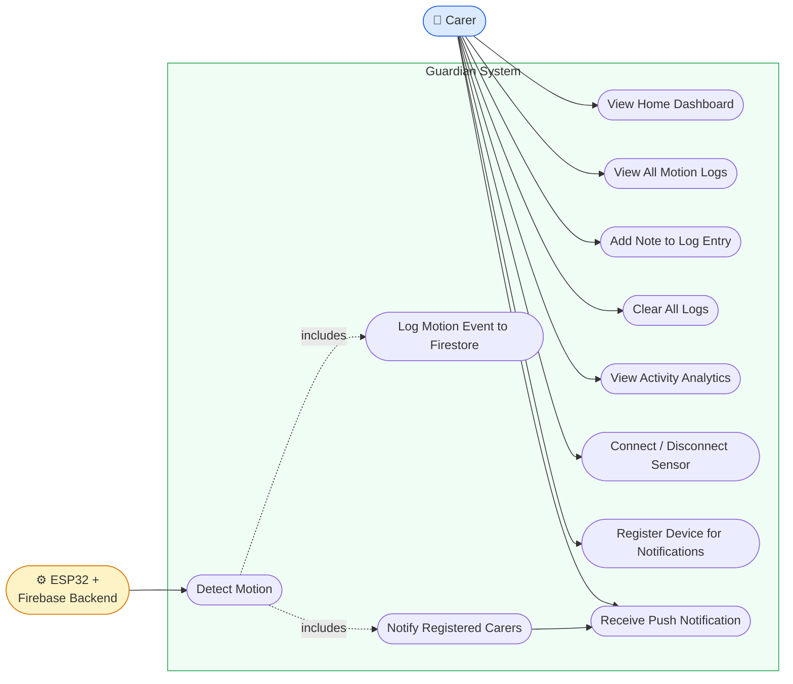
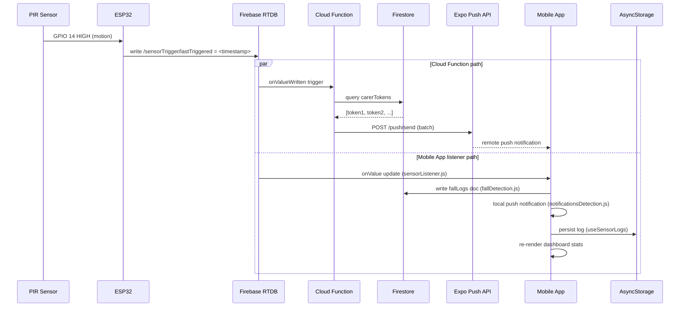
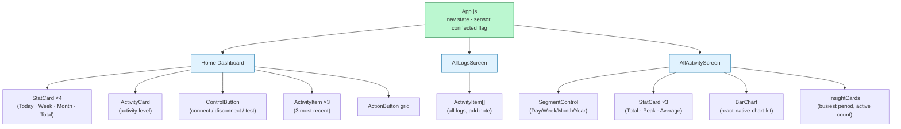
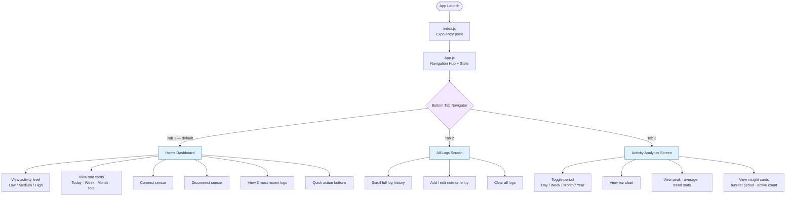
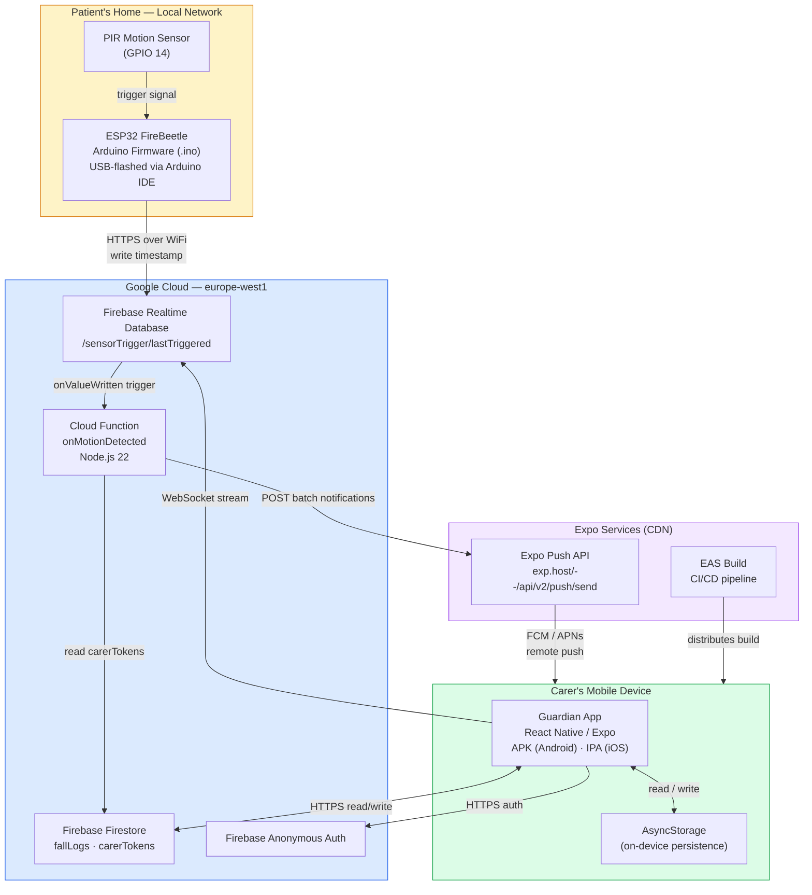

# Guardian — Software Architecture

## System Overview

---

## Use Cases

---

## Data Flow — Motion Detection Event

---

## Component & State Hierarchy

---

## Screen Navigation Flow

---

## Firestore Schema

| Collection | Field | Type | Notes |
|---|---|---|---|
| **fallLogs** | `timestamp` | Timestamp | serverTimestamp |
| | `userId` | string | `"patient-123"` (hardcoded) |
| | `type` | string | `"Motion Detected"` |
| | `severity` | string | `"high"` |
| | `note` | string | Carer-added annotation |
| | `hasNote` | boolean | |
| | `acknowledged` | boolean | |
| | `carerNotified` | boolean | |
| **carerTokens** | `carerId` | string | `"default"` |
| | `token` | string | `ExponentPushToken[...]` |
| | `timestamp` | Timestamp | serverTimestamp |

**RTDB path**: `/sensorTrigger/lastTriggered` → `<unix-ms timestamp>`

---

## Deployment Diagram

---

## Deployment Targets

| Component | How deployed |
|---|---|
| Mobile app (dev) | `npx expo start` → Expo Go on device |
| Mobile app (prod) | `eas build` → App Store / Play Store |
| Cloud Functions | `firebase deploy --only functions` |
| Firestore / RTDB rules | `firebase deploy --only firestore,database` |
| ESP32 firmware | Arduino IDE → USB upload |
